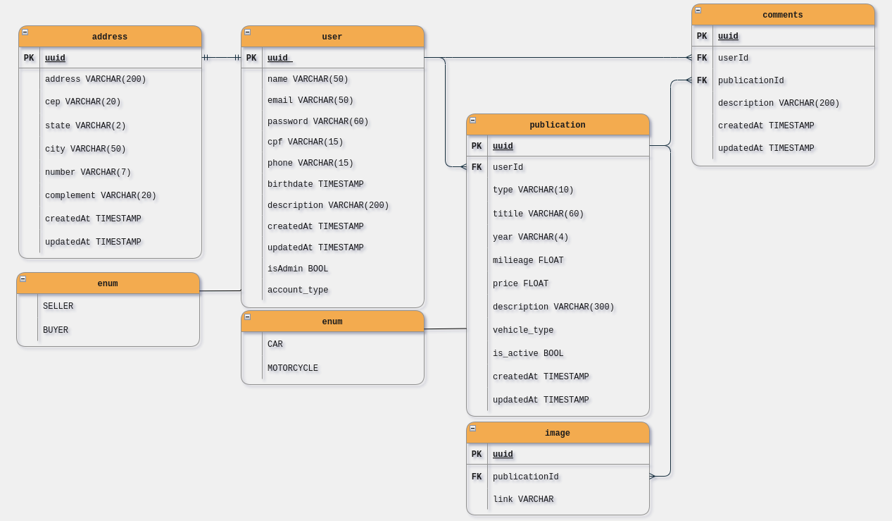

 
# :shopping: Mshop

This is the backend with a RESTful API of an ecommerce created to allow users to buy and sell cars and motorcycles. 

> Link for deployed [API](https://motors-ecommerce-api.herokuapp.com/) \
> Check the [documentation](https://motors-ecommerce-api.herokuapp.com/api-docs/) for proper use

## :toolbox: Tools required

- Docker :whale2:;
- You might also consider using [Postman](https://www.postman.com/downloads/) or [Insomnia](https://insomnia.rest/download) to send API requests.

## 📋 Instalation guide

- Clone this repo;
- On the root folder execute `docker compose up`;
- Once the container is up and running, the configured port is 5000, check it running on `http://localhost:5000/api-docs/`
- Send requests `to http://localhost:5000/***` based on the [docs](https://motors-ecommerce-api.herokuapp.com/api-docs/).

## 💻 Tech stack

      
  
## ER Diagram

## 🔗 Links

- App frontend [repo](https://github.com/osmfaria/Mshop-frontend);
- Deployed [app](https://mshop-ecommerce.vercel.app/).

## :memo: License

[MIT](./LICENSE)

